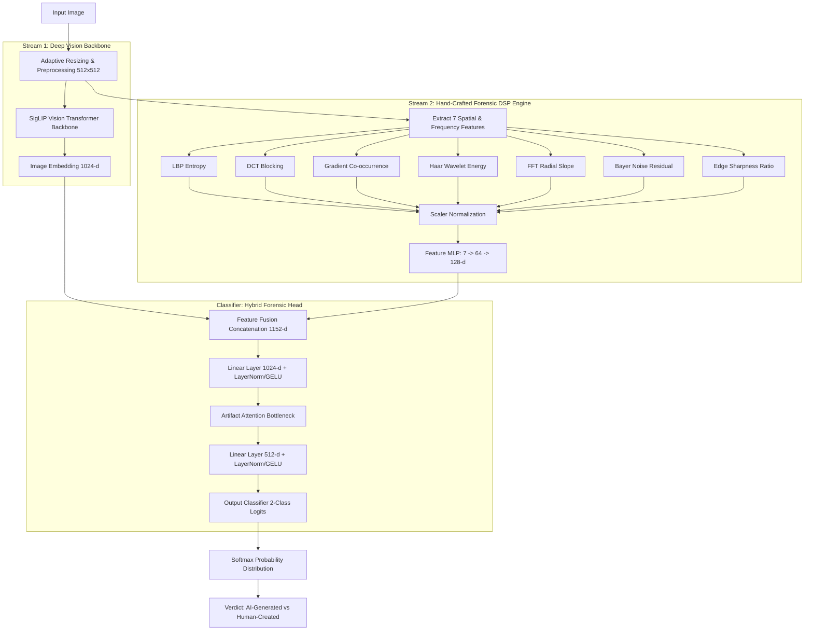

# 🤖 Zero AI: Hybrid Deep Learning & Forensic DSP Engine for AI Image Detection

[](https://www.python.org/)
[](https://pytorch.org/)
[](https://huggingface.co/)
[](https://huggingface.co/spaces/Arunmass/AI_Image_Detector)
[](https://gradio.app/)
[]()
[]()

**Zero AI** is an enterprise-grade, state-of-the-art forensic framework designed to detect AI-generated and synthetic images (from models like Stable Diffusion, Midjourney, DALL-E 3, Adobe Firefly, Imagen, Gemini, and ImageFX) versus authentic human-created photographs. 

By combining a **Vision Transformer / SigLIP neural backbone** with **7 traditional hand-crafted Digital Signal Processing (DSP) forensic feature extractors** fused via an **Artifact Attention Network**, Zero AI achieves robust **96.04% accuracy** across diverse image modalities and unseen generator artifacts.

> 🌐 **Live Interactive Space**: Try Zero AI directly in your browser on Hugging Face Spaces: [**Arunmass/AI_Image_Detector**](https://huggingface.co/spaces/Arunmass/AI_Image_Detector)

---

## 📋 Table of Contents

- [Live Demo](#-live-demo)
- [Key Features](#-key-features)
- [System Architecture](#-system-architecture)
- [Deep-Dive: 7 Traditional Forensic Features](#-deep-dive-7-traditional-forensic-features)
- [Benchmark Results & Metrics](#-benchmark-results--metrics)
- [Repository Structure](#-repository-structure)
- [Installation & Setup](#-installation--setup)
- [Usage Guide](#-usage-guide)
  - [1. Live Demo on Hugging Face Spaces](#1-live-demo-on-hugging-face-spaces)
  - [2. Launching the Local Gradio Web App](#2-launching-the-local-gradio-web-app)
  - [3. Python Programmatic Inference](#3-python-programmatic-inference)
  - [4. Standalone EXIF & Metadata Parser](#4-standalone-exif--metadata-parser)
- [Full-Stack & Library Modules](#-full-stack--library-modules)
- [Citation & Academic Reference](#-citation--academic-reference)

---

## 🌐 Live Demo

You can test Zero AI instantly without installing any local dependencies on Hugging Face Spaces:

👉 **[Arunmass/AI_Image_Detector Space](https://huggingface.co/spaces/Arunmass/AI_Image_Detector)**

Upload any image to receive instant predictions, confidence meters, and traditional forensic breakdown diagnostics.

---

## ✨ Key Features

- **Dual-Stream Hybrid Architecture**: Merges deep semantic representations from Vision Transformers (SigLIP backbone) with fine-grained spatial and frequency domain signal forensics.
- **7 Hand-Crafted Forensic DSP Extractors**: Analyzes microscopic texture, block-grid compression artifacts, high-frequency spectral falloff, color filter array noise residuals, and edge sharpness variance.
- **Artifact Attention Network (`ArtifactAttention`)**: Dynamically weights forensic channels to focus on subtle synthesis anomalies and residual generator signatures.
- **Metadata & EXIF C2PA Engine**: Scans EXIF tags, PNG chunks, IPTC, XMP metadata, and C2PA markers for software footprints from generative platforms (Automatic1111, ComfyUI, Midjourney, DALL-E, etc.).
- **Adaptive Image Resampling**: Features an `AdaptiveResize` pipeline with SigLIP position embedding interpolation to preserve spatial forensic integrity without destruction of micro-artifacts.
- **Interactive Gradio Dashboard**: Modern, responsive UI with real-time confidence visualizers, forensic feature scorecards, breakdown meters, and technical diagnostics.
- **Extensible Full-Stack Ecosystem**: Includes TypeScript/Zod schemas, Drizzle ORM database integrations, React API client bindings, and RevenueCat subscription scripts.

---

## 🏗️ System Architecture



---

## 🔬 Deep-Dive: 7 Traditional Forensic Features

Generative AI models often synthesize visually flawless images, yet fail to accurately model physical sensor noise, lens optics, and spatial frequency correlations. Zero AI computes 7 specific DSP metrics:

| Feature Identifier | Method | Forensic Purpose |
| :--- | :--- | :--- |
| **`lbp_entropy`** | Local Binary Patterns Entropy | Measures micro-texture randomness. AI generators often produce unnaturally uniform or overly chaotic micro-textures. |
| **`dct_blocking`** | Discrete Cosine Transform & Benford's Law | Evaluates 8x8 DCT grid blockiness and first-digit AC coefficient distribution compliance against Benford's Law. |
| **`gradient_cooccurrence`** | Spatial Gradient Co-occurrence | Analyzes high-frequency directional continuity across neighbor pixel intensity gradients. |
| **`wavelet`** | 2D Haar Discrete Wavelet Transform | Calculates energy ratios in high-frequency sub-bands ($HH / (HH + LH + HL)$) to identify high-frequency energy attenuation. |
| **`fft_slope`** | 2D Fast Fourier Transform | Fits a log-log regression slope to the radial 2D FFT spectrum. Natural images adhere to $1/f^\alpha$ power laws ($2.0 \le \alpha \le 3.0$), whereas AI images exhibit spectral spikes or unnatural falloff. |
| **`bayer_noise`** | Bayer Filter Noise Residual Correlation | Evaluates cross-channel correlation (R-G, B-G) of demosaicing noise residuals. Camera hardware exhibits strict Bayer pattern correlation; synthetic models do not. |
| **`edge_sharpness`** | Regional Edge Gradient Ratio | Computes the ratio of central to peripheral spatial gradient magnitude and regional edge variance. |

---

## 📊 Benchmark Results & Metrics

The model was fine-tuned and evaluated on a benchmark dataset of **8,420 images** (7,157 training / 1,263 evaluation split) across diverse real-world and synthetic domains.

### Performance Summary

| Metric | Score |
| :--- | :--- |
| **Accuracy** | **96.04%** |
| **Precision** | **96.28%** |
| **Recall** | **96.04%** |
| **F1-Score** | **96.07%** |
| **Final Loss** | 0.2914 |

### Training Configuration & Regularization
- **Hardware**: NVIDIA Tesla T4 GPU (14.7 GB VRAM)
- **Base Model**: `Ateeqq/ai-vs-human-image-detector` / SigLIP Vision Transformer
- **Optimizer**: AdamW ($\text{LR} = 5 \times 10^{-6}$, Warmup Ratio = 0.15, Precision = FP16)
- **Batch Size**: 16 (Gradient Accumulation = 4, Effective Batch Size = 64)
- **Regularization**: Weight Decay (0.05), Label Smoothing (0.1), Dropout (0.3), Early Stopping (5 epochs)
- **Data Augmentation**: Random resized crop, horizontal flip ($p=0.5$), rotation ($\pm 15^\circ$), affine transforms, color jitter (brightness, contrast, saturation, hue), Gaussian blur ($\sigma \in [0.1, 2.0]$)

---

## 📁 Repository Structure

```
Zero AI/
├── code_latest/
│   ├── app.py                      # Production Gradio web engine (Hybrid model + 7 DSP features)
│   └── Training_code_without_output.ipynb  # End-to-end training & fine-tuning notebook
├── Code/
│   ├── inference_app.py            # Standalone inference engine with EXIF/metadata parser
│   └── ai-image-detector.ipynb     # Jupyter notebook for forensic analysis & experiments
├── models/
│   ├── ai_image/                   # SafeTensors weights, checkpoints, & training summaries
│   ├── ai_text/                    # Pretrained weights for text detection modules
│   └── ai_video/                   # Pretrained weights for video frame analysis
├── Dataset/
│   └── raw_images/                 # Training dataset repository structure
├── Sample_test/                    # Evaluation benchmark suite (Real vs AI image pairs)
├── lib/                            # Full-stack ecosystem libraries
│   ├── api-client-react/           # Generated React API client hook bindings
│   ├── api-spec/                   # OpenAPI / Swagger specifications
│   ├── api-zod/                    # Zod validation schemas for request payload validation
│   └── db/                         # Drizzle ORM database schemas & migrations
├── scripts/
│   ├── src/seedRevenueCat.ts       # RevenueCat subscription entitlement script
│   └── post-merge.sh               # Git hook workflow script
├── papers/                         # Literature research papers & theoretical foundation
├── Dr_Hannah_ArunKumar_Dissertation-2.pdf # Master's Thesis Dissertation Document
└── README.md                       # Project documentation
```

---

## ⚡ Installation & Setup

### Prerequisites

- **Python**: 3.10 or higher
- **PyTorch**: 2.0+ (CUDA recommended for training; CPU supported for inference)
- **Dependencies**: `transformers`, `torchvision`, `gradio`, `scipy`, `pywavelets`, `pillow`, `numpy`

### Step 1: Clone & Environment Setup

```bash
# Clone the repository
git clone https://github.com/your-username/Zero-AI.git
cd Zero-AI

# Create virtual environment
python -m venv venv

# Activate environment
# On Linux/macOS:
source venv/bin/activate
# On Windows:
venv\Scripts\activate
```

### Step 2: Install Dependencies

```bash
pip install torch torchvision --index-url https://download.pytorch.org/whl/cu118
pip install transformers gradio scipy pywavelets pillow numpy
```

---

## 🚀 Usage Guide

### 1. Live Demo on Hugging Face Spaces

Test the model online without any setup:
- Navigate to [**https://huggingface.co/spaces/Arunmass/AI_Image_Detector**](https://huggingface.co/spaces/Arunmass/AI_Image_Detector)
- Drag and drop any image file to view real-time forensic detection results.

### 2. Launching the Local Gradio Web App

To start the interactive web application locally with real-time UI diagnosis:

```bash
python code_latest/app.py
```

Open your browser at `http://localhost:7860` to access the interface.

### 3. Python Programmatic Inference

You can run predictions directly within your own Python code:

```python
from PIL import Image
from code_latest.app import predict

# Load image
img = Image.open("Sample_test/Twin_ai_1.jpg")

# Run prediction
results = predict(img)

print(f"AI Probability: {results['ai_prob'] * 100:.2f}%")
print(f"Human Probability: {results['real_prob'] * 100:.2f}%")
```

### 4. Standalone EXIF & Metadata Parser

To analyze EXIF metadata, IPTC fields, PNG chunks, and C2PA markers:

```bash
python Code/inference_app.py
```

This checks for explicit AI markers from platforms like Midjourney, DALL-E, Adobe Firefly, Stable Diffusion, ComfyUI, and Bing Image Creator.

---

## 🗄️ Full-Stack & Library Modules

Zero AI is built for enterprise deployment beyond basic Python scripts. The `lib/` directory contains complete full-stack integration packages:

- **`lib/db`**: TypeScript database schemas using **Drizzle ORM** (`auth.ts`, `users`, `sessions`, `subscriptions`).
- **`lib/api-zod`**: Type-safe input/output payload validation with **Zod**.
- **`lib/api-client-react`**: Custom React hooks for seamlessly embedding AI detection into frontend applications.
- **`scripts/src/seedRevenueCat.ts`**: Integration with **RevenueCat** for managing tier-based API subscription plans (Free, Pro, Enterprise).

---

## 📜 Citation & Academic Reference

If you use Zero AI in your research or academic publication, please cite the underlying dissertation project:

```bibtex
@mastersthesis{ArunKumar2026ZeroAI,
  author       = {Dr. Hannah ArunKumar},
  title        = {Zero AI: Hybrid Deep Learning and Signal Processing Framework for Synthetic Media & DeepFake Image Forensics},
  school       = {VIT University},
  year         = {2026},
  type         = {Master's Dissertation},
  note         = {Dataset size: 8,420 images, Model Accuracy: 96.04%}
}
```

---

## 📄 License

Distributed under the MIT License. See `LICENSE` for more details.
